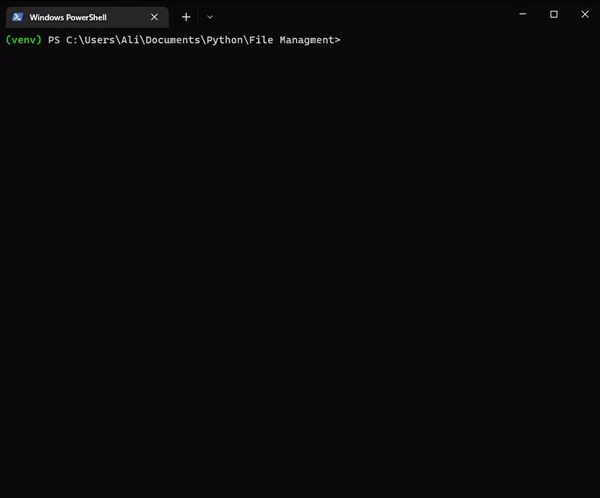
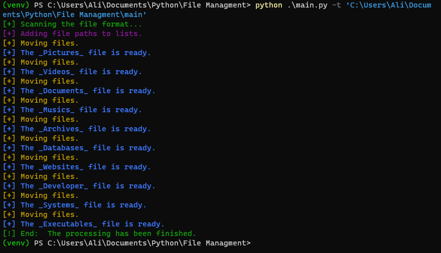

<h1 align='center'>Python File Management</h1>
<p align='center'>Basic File Management using Python. This project is a very simple one with just a python script to automate the process of moving files to different folders by file type. This script uses os and Shutil python modules.  It works according to your operating system.</p>

<p align='center'>
    
</p>


## Requirements
You can install the Requirements by running the command:

```
pip install -r requirements.txt
```

```
colorama==0.4.4
```

## Installation and How to use?
```sh
$ git clone https://github.com/alii76tt/python-file-management
$ cd python-file-management
$ pip install -r requirements.txt
$ python main.py -t '<targetPath>'
```
## YouTube Video
[](https://www.youtube.com/watch?v=E1YD9iPzd3I "Python File Management")
## Screenshots
<p align='center'>
    
</p>
